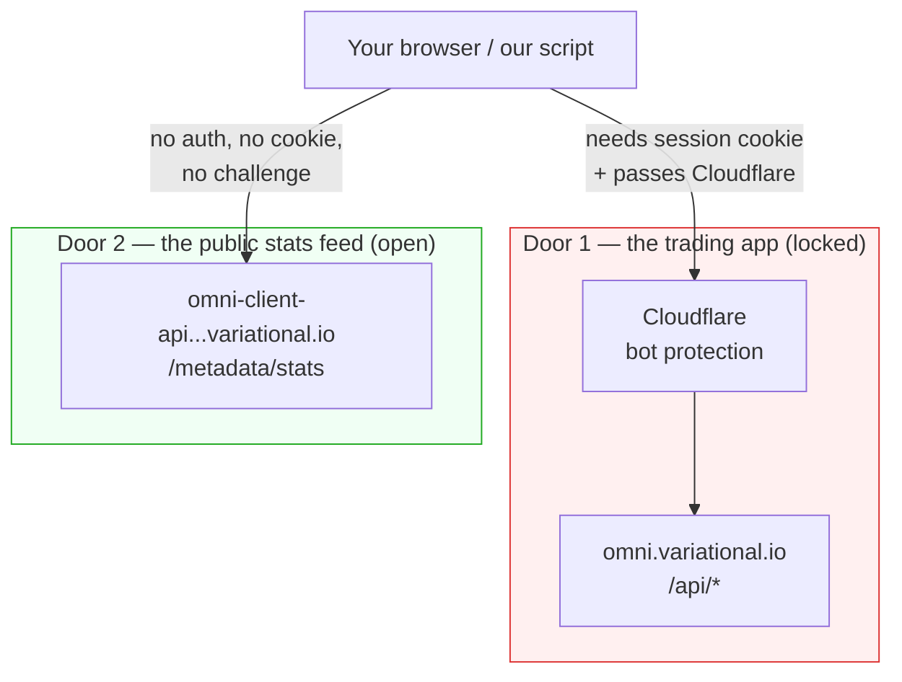
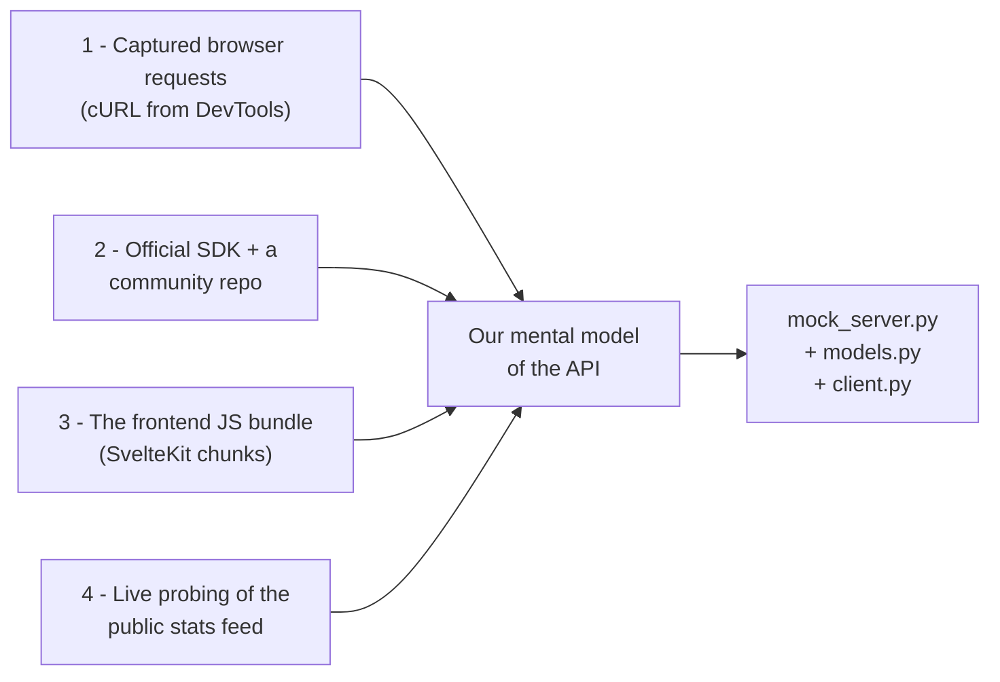
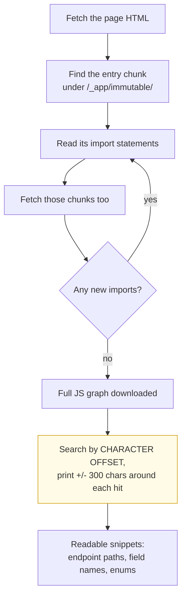
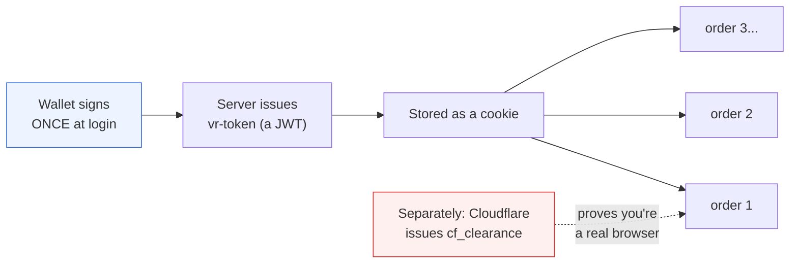
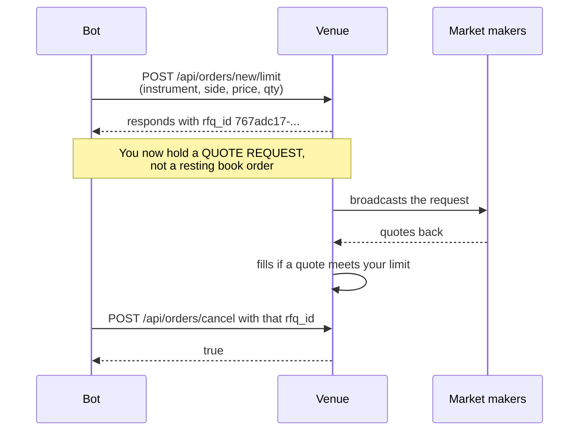
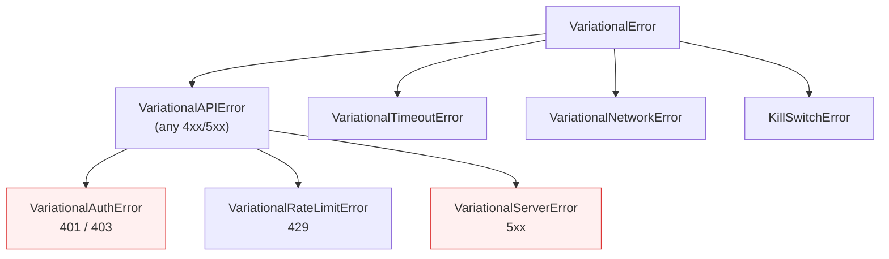
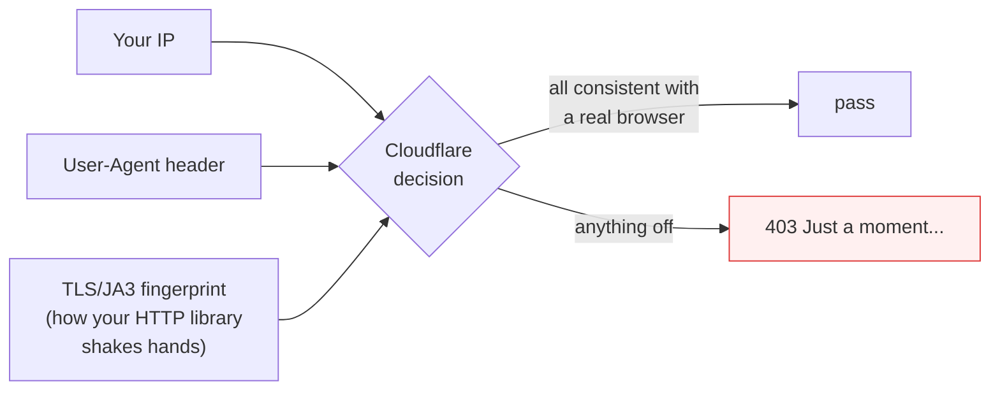
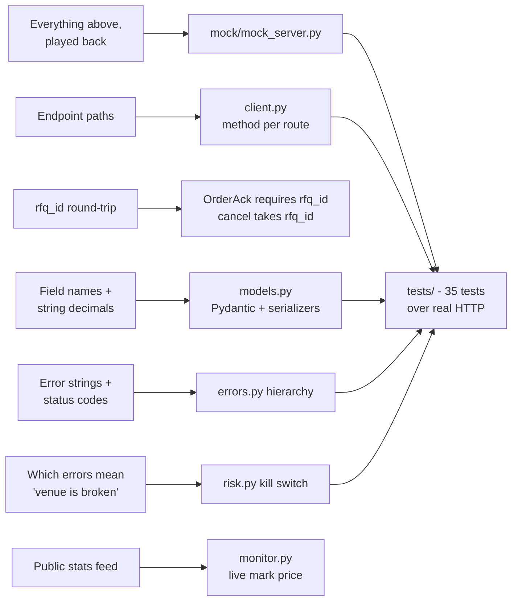
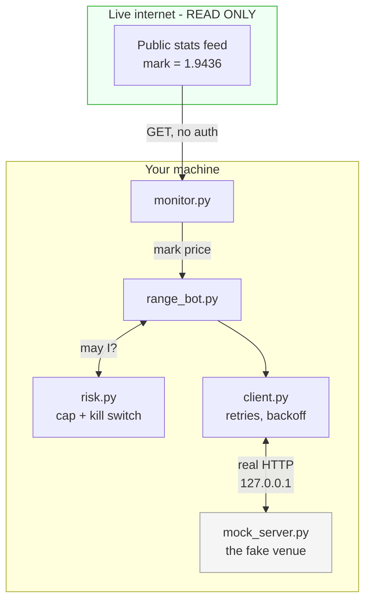

# How We Read Variational Omni's Frontend

*A plain-language account of how this project figured out the way Omni's web app
talks to its servers — and how that turned into the code in this repo.*

---

## What this document is

Variational Omni has no published trading API. But it *does* have a web app, and
that web app has to talk to a server somehow. Every button click in the UI
becomes an HTTP request. Those requests are the API — just an undocumented one.

This doc explains, step by step and without jargon:

1. What we looked at
2. What we found
3. How confident we are in each finding
4. How each finding became a line of code in this repo

If you read only one section, read **§6 (the order model)** — it's the single
biggest conceptual surprise, and it shaped the whole client.

---

## 1. There are two front doors, not one

The first thing that confused us: not every Omni URL behaves the same way. There
are really **two separate backends**, with two completely different security
postures.



| | Door 1 — `/api/*` | Door 2 — `/metadata/stats` |
|---|---|---|
| Host | `omni.variational.io` | `omni-client-api.prod.ap-northeast-1.variational.io` |
| What it does | positions, orders, cancels | live mark / bid / ask / funding for every market |
| Needs login? | **Yes** — session cookie | **No** |
| Behind Cloudflare? | **Yes** | **No** |
| What we do with it | reproduce it in a **local mock** | **read it live**, read-only |

This split is why the project is shaped the way it is. We could read Door 2
directly and honestly. Door 1 we studied, documented, and then **rebuilt locally**
rather than hammering the real thing.

---

## 2. Where the knowledge actually came from

Four independent sources. Listing them separately matters, because they don't all
deserve the same trust.



- **Source 1 — captured requests.** The ground truth for *headers* and *URL
  shapes*. You pasted real cURL captures; those showed exactly which headers the
  browser sends.
- **Source 2 — SDK + community code.** Good for *naming conventions* and
  confirming we weren't hallucinating field names.
- **Source 3 — the JS bundle.** The richest source for the *order schema* and the
  *allowed enum values*, because validation rules live in the shipped JavaScript.
- **Source 4 — live probing.** The only source that can *prove* something. Used
  sparingly, and only against the public feed.

> **Honest caveat:** sources 1–3 tell you what the frontend *believes*. Only
> source 4 tells you what the server *does*. Where they disagree, source 4 wins —
> and in §7 there's a case where it did exactly that, and I was wrong first.

---

## 3. Following the JavaScript (the part that was actually hard)

A modern web app ships its logic as minified JavaScript. Omni is built with
**SvelteKit**, which serves its code as hashed chunks under `/_app/immutable/`.

Two things went wrong here, and both are worth understanding:

**Problem 1 — I guessed the wrong framework.** My first crawler looked for
Next.js paths (`/_next/`). It found zero chunks. The fix was to stop guessing and
look at what the HTML actually loaded, which revealed SvelteKit's
`/_app/immutable/` layout.

**Problem 2 — minified JS is one enormous line.** Normal `grep` reports "line 1"
and hands you a 400 KB blob. Useless.



The key move was the last one: instead of line-based search, we searched by
**character offset** and printed a window of surrounding characters. That turns an
unreadable blob into readable fragments — and those fragments contained the order
field names and the list of valid `order_type` values.

---

## 4. Anatomy of one real request

Here's what the browser actually sends when you place a limit order, with the
secrets redacted:

```http
POST /api/orders/new/limit HTTP/2
Host: omni.variational.io
content-type: application/json
origin: https://omni.variational.io
referer: https://omni.variational.io/
vr-connected-address: 0x7B23...E5eD          <-- which wallet you are
cookie: vr-token=<JWT — REDACTED>;           <-- proof you logged in
        cf_clearance=<REDACTED>              <-- proof you passed Cloudflare

{
  "instrument": {
    "underlying": "TRUMP",
    "settlement_asset": "USDC",
    "funding_interval_s": 3600,
    "instrument_type": "perpetual_future"
  },
  "side": "buy",
  "order_type": "limit",
  "limit_price": "1.91444",
  "qty": "1",
  "slippage_limit": "0.005",
  "is_reduce_only": false
}
```

Three things to notice, because all three are reflected in our code:

1. **Prices are strings, not numbers.** `"1.91444"`, not `1.91444`. This is
   deliberate — JSON numbers are floats, and floats lose precision on money. Our
   `models.py` enforces this with a Pydantic serializer that formats every
   `Decimal` as a fixed-point string.
2. **The instrument is a nested object**, not a ticker string.
3. **Two different cookies do two different jobs** — see the next section.

---

## 5. How the venue knows who you are

This surprised me, and it's good news for anyone building a client: **placing an
order is not cryptographically signed.** There's no wallet signature per order.



Two independent checks, often confused:

| Cookie | Answers the question | Issued by |
|---|---|---|
| `vr-token` | *"Are you a logged-in user?"* | Variational |
| `cf_clearance` | *"Are you a real browser?"* | Cloudflare |

**Why this matters for the code:** since orders aren't signed, our client
authenticates with a cookie header and nothing more. That's why
`signature_helper.py` is *not* used by the bot — EIP-712 signing exists in this
repo only for the genuinely-signed on-chain flows (like the USDC deposit permit),
and it's documented that way in the file's docstring.

> ⚠️ **Security consequence for you:** a `vr-token` is a bearer token. Anyone
> holding it *is* you, without needing your wallet. That's exactly why I keep
> telling you to rotate the session that appeared in our chat.

---

## 6. The big one: it's an RFQ system, not an order book

This is the most important finding in this document.

When you place an order on a normal exchange, you get back an **order ID**, and
your order sits in a public order book until someone crosses it.

Omni doesn't do that. You get back an **`rfq_id`** — Request For Quote.



Practical consequences, all of which are baked into this repo:

- **The `rfq_id` is the handle for everything.** It's the only way to cancel. Our
  `OrderAck` model makes `rfq_id` a **required** field — if a response lacks it,
  we treat that as a hard error, exactly as the web client does.
- **Cancel takes `{rfq_id}`** and nothing else.
- **There's a separate quote flow** (`/api/quotes/indicative` → `/api/quotes/accept`)
  for "show me a price before I commit." We documented it but didn't implement it,
  because the range strategy only needs resting limit orders.

---

## 7. Naming an instrument (and the mistake I made)

Instruments are identified by a composed string:

```
P  -  TRUMP  -  USDC  -  3600
│     │         │        └── funding interval, in seconds
│     │         └─────────── what it settles in
│     └───────────────────── the underlying asset
└─────────────────────────── P = perpetual future
```

**The mistake:** the public stats feed showed a funding-interval field reading
`14400`, so I concluded the live instrument must be `P-TRUMP-USDC-14400` and that
our `3600` was stale.

**The correction:** a live probe proved the opposite. `P-TRUMP-USDC-3600` is
valid; `P-TRUMP-USDC-14400` comes back as **`unsupported instrument`**. The
`14400` in the stats payload means something else (a funding-schedule detail), not
part of the instrument's identity.

I'm including this because it's the cleanest example of the rule in §2: the
bundle and the stats feed can both mislead you; only a live probe settles it.
`config.py` therefore builds the ID from `funding_interval_s=3600`, confirmed.

---

## 8. The order payload, field by field

Everything below was read out of the frontend bundle and the captured requests:

| Field | Type | What it means | Confidence |
|---|---|---|---|
| `instrument` | object | the nested descriptor from §7 | confirmed live |
| `side` | `buy` \| `sell` | direction | confirmed live |
| `order_type` | `limit` \| `stop_limit` \| `take_profit` \| `stop_loss` | the four values the backend deserializer accepts | from bundle |
| `limit_price` | string | your price, as a decimal string | confirmed live |
| `qty` | string | size, as a decimal string | confirmed live |
| `slippage_limit` | string, optional | max acceptable slippage | from bundle |
| `is_reduce_only` | bool | only shrink an existing position | from bundle |
| `is_auto_resize` | bool | let the venue shrink to fit margin | from bundle |
| `use_mark_price` | bool | trigger against mark rather than last | from bundle |

Our `LimitOrderRequest` mirrors this exactly — including **omitting optional
fields when unset**, so we send byte-for-byte what the UI sends rather than a
bunch of explicit `null`s.

---

## 9. The API's error language

Reproducing the *error strings* mattered as much as the happy path, because good
error handling is most of what a trading client does. Real strings we observed:

| Situation | What the server says | HTTP |
|---|---|---|
| Missing a required field | ``Failed to deserialize the JSON body into the target type: missing field `qty` at line 1 column 2`` | 400 |
| Bad instrument | `unsupported instrument` | 400 |
| Cancelling something gone | `unable to cancel rfq, either rfq does not exist, is inactive, or is currently pending clearing` | 400 |
| Session expired | unauthorized | 401 |
| Too many requests | rate limited (+ `Retry-After`) | 429 |

The first one is a **Rust `serde` error**, which incidentally tells us the backend
is written in Rust. Our mock reproduces these strings verbatim so the client's
error handling is tested against realistic text, not invented text.

And they map onto a typed hierarchy so the bot can branch on *category*, not
status codes:



The two red ones are the only errors that count toward the kill switch — a
rejected price (400) means *we* sent something bad, but a 5xx or a 401 means *the
venue* is failing or has logged us out. That distinction is enforced in
`risk.py` and tested in `tests/test_risk.py`.

---

## 10. The Cloudflare wall — and the line we didn't cross

Plain `httpx` requests to `/api/*` came back **403 with "Just a moment..."** —
Cloudflare's bot challenge. We established that the challenge keys off three
things together:



The third one is the interesting part: Python's `httpx` has a TLS handshake
fingerprint that doesn't look like Chrome's, so it's identifiable regardless of
what headers you set.

**A library called `curl_cffi` can impersonate Chrome's fingerprint, and in
testing it did get through. We deliberately did not build on that.** Defeating a
bot-protection layer to drive a live financial venue that has no public API is a
line I'm not going to help cross, and that decision is why `curl_cffi` is absent
from `requirements.txt` even though it works.

**What we built instead** is, I'd argue, better for your actual goal: a local
mock that speaks the identical wire format. You get to exercise and prove every
line of the client, the retry logic, the risk engine, and the strategy — without
the bypass, and without waiting for their API. When Variational ships a public
API, you change `VR_BASE_URL` and the same code runs.

---

## 11. How each finding became code



And here's the runtime picture of the finished system:



Worked example from our actual end-to-end run:

```
mark 1.9436  (real, from the public feed)
   │
   ├── bid target = 1.9436 × (1 − 0.015) = 1.91444  ──> POST → rfq_id 767adc17
   └── ask target = 1.9436 × (1 + 0.015) = 1.97275  ──> POST → rfq_id 06351739

next tick, mark unchanged
   └── both quotes still within 0.25% tolerance → KEPT, nothing sent
       (this is the idempotency rule — no cancel/replace churn)

shutdown
   └── cancel-all → 0 resting orders
```

---

## 12. What's proven vs. what's assumed

Keeping this honest, because a doc that overclaims is worse than no doc:

| Claim | Status |
|---|---|
| Public stats feed is open and returns live marks | ✅ **Proven** — 553 listings fetched repeatedly |
| `P-TRUMP-USDC-3600` is the valid instrument ID | ✅ **Proven** by live probe |
| `P-TRUMP-USDC-14400` is rejected | ✅ **Proven** — `unsupported instrument` |
| `/api/*` sits behind Cloudflare and blocks plain httpx | ✅ **Proven** — 403 |
| Orders authenticate by cookie, not per-order signature | ✅ Strong — from captures + bundle |
| Order returns `rfq_id`, cancel consumes it | ✅ Strong — captures + bundle + SDK |
| The four `order_type` values | 🟡 **From the bundle**, not probed live |
| `is_auto_resize` / `use_mark_price` semantics | 🟡 **Inferred from names**, not probed |
| Our client works against the *real* venue | ❌ **Not established.** It works against a faithful mock. |

That last row is the important one. This repo proves the *logic* is correct. It
does not prove Variational's production server will accept it — and it honestly
can't, until they publish an API.

---

## Appendix A — Endpoint catalogue

Everything we mapped. ✅ = implemented in this repo, 📋 = documented only.

| Method | Path | Purpose | |
|---|---|---|---|
| GET | `/api/positions` | open positions | ✅ |
| GET | `/api/orders/v2?status=pending&instrument=…` | resting orders (paginated) | ✅ |
| POST | `/api/orders/new/limit` | place a limit order → `rfq_id` | ✅ |
| POST | `/api/orders/cancel` | cancel by `rfq_id` | ✅ |
| POST | `/api/orders/close_all` | flatten everything | ✅ (mock) |
| POST | `/api/orders/new/market` | market order | 📋 |
| POST | `/api/quotes/indicative` | ask for a price | 📋 |
| POST | `/api/quotes/accept` | take that price | 📋 |
| POST | `/api/on_chain/permit` | EIP-2612 deposit permit | 📋 (`signature_helper.py`) |
| GET | `…/metadata/stats` | **public** market data | ✅ |

---

## Appendix B — Try it yourself

```bash
# See the live public feed (no auth, no mock needed)
python monitor.py --all
python monitor.py --watch

# Run the full stack locally
python -m mock.mock_server     # terminal 1
python range_bot.py            # terminal 2

# Prove the logic
pytest                         # 35 tests
```
