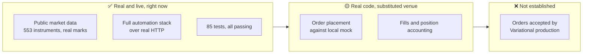
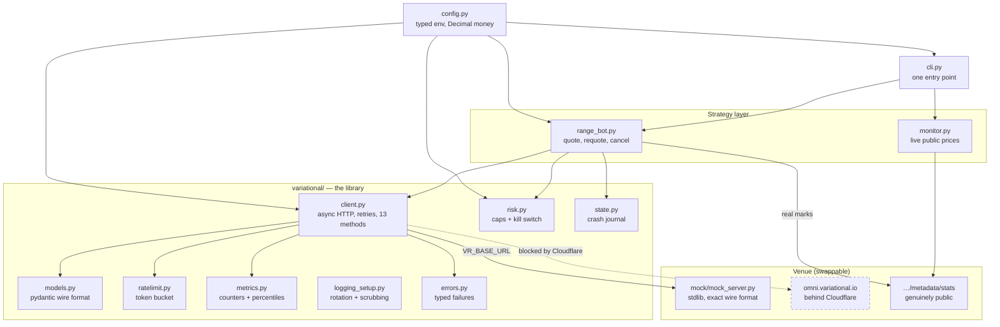
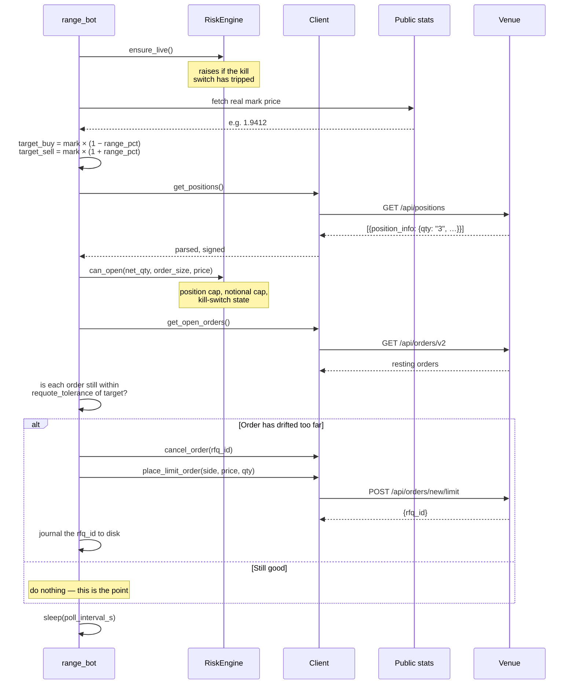
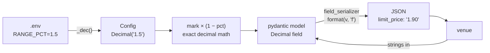
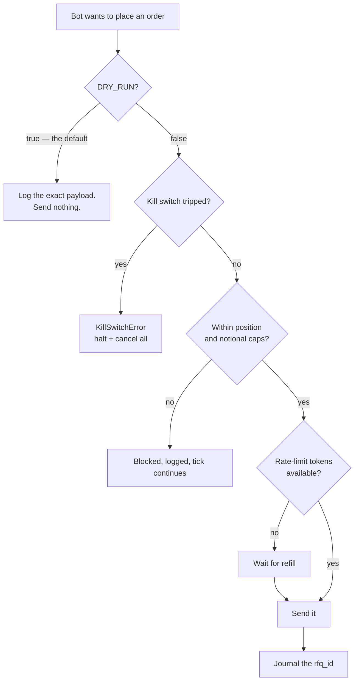
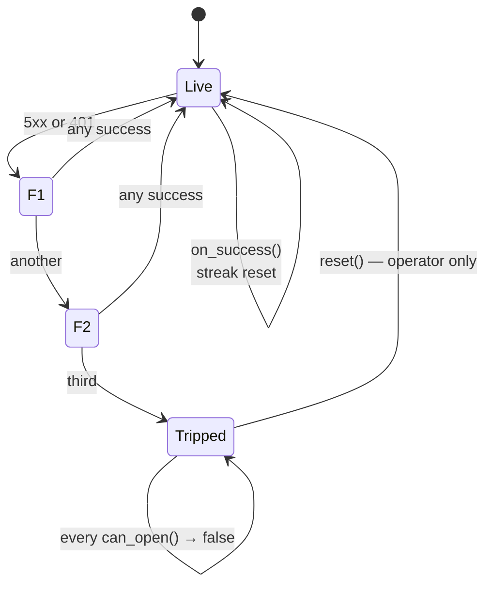
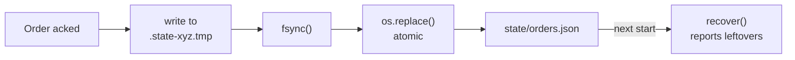
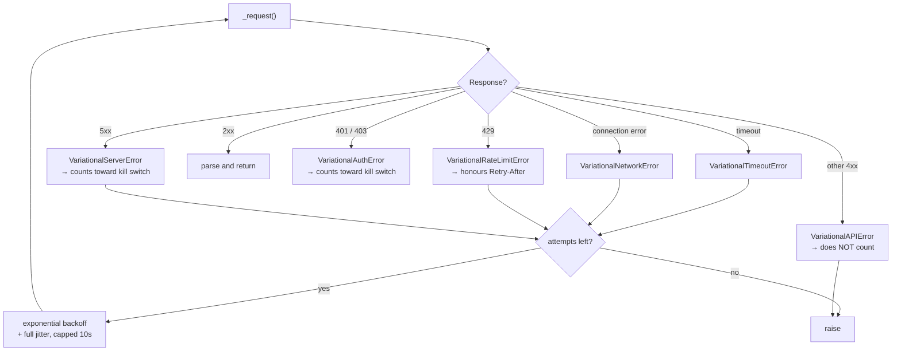
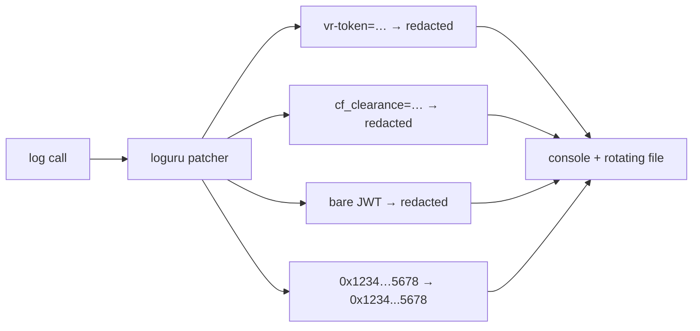
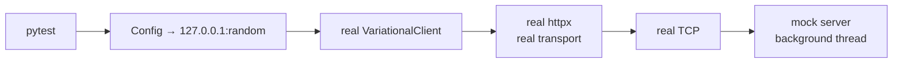

# What We Built — The Whole Thing, In Plain English

> A map of the entire repository: what each piece does, why it exists, what it
> protects you from, and what it honestly cannot do.
>
> Companion document: [How We Read Variational Omni's Frontend](./frontend-api-reverse-engineering.md)
> covers the reverse-engineering. This one covers the software.

---

## The one-paragraph version

This is an async Python trading automation suite for Variational Omni. It
places and manages resting limit orders around a live mark price, refuses to
exceed configured risk limits, stops itself when the venue starts failing, and
writes down what it has done so a crash doesn't leave orphaned orders nobody
knows about. It runs end to end right now — against a local mock that speaks
the venue's exact wire format, plus a live read-only feed of real prices. It
does **not** place real orders on Variational, because Variational has no
public order API yet.

---

## The honest framing (read this first)

A document that overclaims is worse than no document, so here is the line:



**Why the last box is empty:** Variational's `/api/*` endpoints sit behind
Cloudflare and there is no documented programmatic order API. Libraries exist
that defeat the Cloudflare check — `curl_cffi`, `cloudscraper` — and they work.
We deliberately did not adopt them. That decision is explained in
[§10 of the other doc](./frontend-api-reverse-engineering.md#10-the-cloudflare-wall--and-the-line-we-didnt-cross).

The consequence is architectural, not cosmetic: the whole suite had to be
designed so that the venue is a **swappable** component. `VR_BASE_URL` is a
one-line change. Everything above it — the strategy, the risk engine, the
retry logic, the journalling — is venue-agnostic and already proven.

---

## The shape of the thing



Read it as three layers. **Strategy** decides what to do. **The library**
knows how to talk to the venue safely. **Config** is typed and immutable and
loaded once. The venue at the bottom is interchangeable, which is the whole
reason this works at all.

---

## One tick of the bot, step by step

This is the loop that actually runs. Everything else exists to make these
twelve steps safe.



**The idempotency check is the load-bearing part.** A naive bot cancels and
replaces both orders every tick. At a 10-second poll that's 17,000 cancel/place
pairs a day, each one a chance to be rate-limited, half-filled, or rejected.
`REQUOTE_TOLERANCE_PCT` means an order is only replaced once it has genuinely
drifted. On a quiet market the bot does nothing for hours, which is correct
behaviour, not a bug.

---

## Money: why there is no `float` anywhere

```python
>>> 0.1 + 0.2
0.30000000000000004
```

That is not a rounding display quirk; it's the actual value. Binary floating
point cannot represent `0.1`. Do that arithmetic on a price a few thousand
times and your position accounting drifts away from the venue's.

So every money-like value in this repo is a `decimal.Decimal`, from the moment
it leaves the environment to the moment it's serialised:



Three details that matter:

- **`format(v, "f")`, not `str(v)`.** `str(Decimal("0.00001"))` can produce
  `1E-5`, which some backends reject. `format(v, "f")` always gives plain
  decimal notation.
- **The journal stringifies too.** `json` cannot encode a `Decimal`, and the
  obvious workaround is a `float()` cast — the one thing we never do. The state
  store formats exactly instead. (This was a real bug; the tests caught it.)
- **`_opt_dec()` returns `None`, not `0`.** For a risk limit, "not configured"
  and "configured to zero" are opposite instructions. A zero notional cap would
  reject every order. Blank means off.

---

## The safety layers

There are four, and they're deliberately independent — each one catches things
the others don't.



### Layer 1 — `DRY_RUN` is the default

Every mutating method checks it and returns a synthetic ack:

```python
if self._cfg.dry_run:
    logger.info("[DRY_RUN] would POST /api/orders/new/limit {}", payload)
    return OrderAck(rfq_id="dry-run-000000000000", status="dry_run")
```

The payload is logged in full, so you can read exactly what *would* have been
sent. The CLI makes this structural: `--live` is the only way to turn it off,
and `--dry-run` beats `--live` if both are passed, so the safe option can't be
lost to flag ordering. There is deliberately **no flag that goes live by being
forgotten**, and a banner prints the mode before anything is sent.

### Layer 2 — the kill switch

Three consecutive server (5xx) or auth (401/403) failures latch the bot into a
halted state. Client errors like a rejected price **don't** count, because
those mean "your request was bad," not "the venue is failing."



Nothing clears a tripped switch automatically. That's intentional: if the venue
has been returning 500s, the right next step is a human looking at it.

### Layer 3 — the risk gates

| Limit | What it caps | Default |
|---|---|---|
| `MAX_POSITION_SIZE` | abs(net position) | 10 |
| `MAX_NOTIONAL` | abs(net) × price | off |
| `DAILY_LOSS_LIMIT` | realized loss for the session → trips kill switch | off |
| `MAX_DRAWDOWN` | drop from peak realized equity → trips kill switch | off |

The notional check needs a price, and if one isn't supplied it is **skipped
rather than guessed**. A risk engine that invents inputs is worse than one that
admits it can't check.

### Layer 4 — the journal

If the process dies between "venue accepted my order" and "I cancelled it,"
that order is still resting on the venue with nobody managing it. So every
placement is written to disk *before* it's treated as live:



Temp file in the same directory, `fsync`, then `os.replace` — which is atomic
on POSIX and Windows both. A kill mid-write cannot leave a truncated journal.
And if the file is corrupt *anyway*, it's quarantined to `.corrupt` rather than
taking the process down on startup.

---

## When things fail

The venue fails in several distinguishable ways, and treating them all the same
is how you get a bot that retries a bad request forever.



Two choices worth calling out:

- **Full jitter, not fixed backoff.** `random.uniform(0, 2^attempt)` rather
  than `2^attempt`. If several clients back off on the same schedule they all
  return at the same instant and hammer the recovering server together. Jitter
  spreads them out.
- **`Retry-After` wins when present.** The venue telling you when to come back
  is better information than any formula. `x-rate-limit-resets-in-ms` is also
  parsed, and correctly treated as milliseconds while `retry-after` is seconds.

---

## The rate limiter, and a bug worth remembering

Reacting to a 429 is necessary but late — by then you've already been noisy. A
token bucket keeps requests *proactively* under a chosen rate, refilling
continuously so bursts are allowed up to a cap and the sustained rate settles
where you asked.

The interesting part is a bug the tests found:

```
monotonic    resolution: 0.015625      ← 15.6 milliseconds
perf_counter resolution: 1e-07         ← 0.1 microseconds

monotonic delta over a 10ms sleep:    0.016      ← wrong
perf_counter delta over a 10ms sleep: 0.0106     ← right
```

Both clocks are monotonic. But on Windows `time.monotonic()` is
`GetTickCount64`, with **15.6 ms granularity** — so a 10 ms sleep can register
as zero elapsed time. A bucket built to *smooth* pacing was refilling in
visible 15.6 ms lurches, the exact opposite of its purpose.

`perf_counter` is monotonic *and* sub-microsecond on every platform Python
supports. The refill test only fails on Windows, which is why Windows is in the
CI matrix.

One more detail: `acquire()` sleeps **outside** the lock.

```python
async with self._lock:
    ...
    delay = deficit / self._rate
# released before sleeping, so other tasks make progress
await asyncio.sleep(delay)
```

Holding a lock across an `await asyncio.sleep` would serialise every coroutine
behind the one that's waiting, turning a rate limiter into a global stall.

---

## Observability

### Metrics

Dependency-free counters: requests, retries, per-status-code tallies, orders
placed/cancelled/rejected, ticks, and latency percentiles. `as_dict()` is the
export seam if you later want to ship them somewhere; `summary()` is the
human-readable shutdown report.

Two deliberate choices:

- **Nearest-rank percentiles with `math.ceil`, not `round`.** Python's `round`
  is banker's rounding, so an exact `.5` rank — p50 of five samples — picks the
  element *below* the nearest rank. `ceil` is the actual definition.
- **A transport failure counts as an error.** A timeout has no status code, and
  the obvious implementation skips it — so a run where every single call timed
  out would cheerfully report "0 errors."

### Logging, and keeping secrets out of it

One module configures every entry point, with an optional rotating file sink.
The rotation matters less than the scrubbing:



Also `diagnose=False` on both sinks. Loguru's diagnostic mode dumps local
variables on an exception — which would print the session cookie straight out
of a stack frame into a log file someone later pastes into a bug report.

---

## The mock, and why it's a real HTTP server

`mock/mock_server.py` is a standard-library `ThreadingHTTPServer`. No
framework, so `pip install -r requirements.txt` is enough to run it.

It implements the venue's **exact** contract: endpoint paths, field names, the
`rfq_id` round trip, the nested `position_info` shape, and the literal Rust
`serde` error strings the real backend produces:

```
Failed to deserialize the JSON body into the target type:
missing field `qty` at line 1 column 2
```

It also does things a real venue won't do on request:

| Control | Effect |
|---|---|
| `?__status=500` | force one response to a status |
| `?__fail_n=3&__status=503` | fail the next N calls, then behave |
| `?__rate_limit=1` | 429 with a `Retry-After` header |
| `POST /__control {"fail_next": 3}` | latch failures globally |
| `POST /__control {"mark": "1.85"}` | move the mark and fill crossed orders |

That last one makes position accounting testable: weighted-average entry when
adding, no flip-through-zero on reduce-only fills, positions removed when flat.

---

## How the tests are built

85 tests, ~12 seconds, no network.

The design decision: tests run against the mock **over real HTTP**, in-process
on a random free port. They do not mock `httpx`.



This costs milliseconds and buys a lot: the real retry path, real backoff, real
timeout handling, real header construction, real JSON serialisation, real
connection pooling. A test that patches `httpx.AsyncClient.request` proves the
code calls a function you wrote. This proves bytes go out and come back.

| File | Tests | Covers |
|---|---|---|
| `test_models.py` | 11 | serialisation, `Decimal` precision, parsers |
| `test_risk.py` | 9 | caps, kill switch, PnL limits |
| `test_client.py` | 10 | retries, backoff, error mapping, DRY_RUN |
| `test_range_bot.py` | 5 | tick logic, idempotency, shutdown |
| `test_support.py` | 17 | rate limiter, metrics, journal, scrubbing |
| `test_quote_flow.py` | 16 | quote flow, nested positions, fills |
| `test_cli.py` | 17 | every subcommand, the `--live` safety default |

There's no `pytest-asyncio`. Each async test wraps its body and calls
`asyncio.run(body())` — one less dependency, and the event loop boundary is
explicit.

---

## The CLI

```bash
python -m cli status                  # positions, orders, balance
python -m cli quote --qty 1           # what price would I get?
python -m cli place --side buy --price 1.90 --qty 1
python -m cli place --side buy --qty 1 --market
python -m cli trigger --side sell --type stop_loss --trigger-price 1.80 --qty 1
python -m cli cancel-all
python -m cli close-all
python -m cli run                     # the bot
python -m cli monitor                 # live public feed
python -m cli mock                    # the test venue
```

`status --json` emits machine-readable output with money as strings, so it
pipes into `jq` without losing precision.

---

## CI

Two jobs on every push:

**Tests** — 6 combinations: `{ubuntu, windows} × {3.10, 3.11, 3.12}`. Windows
is there because of the clock bug above; a Linux-only matrix would have shipped
it.

**Secrets scan** — fails the build if a tracked file contains a `vr-token`
JWT, a `cf_clearance` value, or an un-annotated wallet address, or if `.env` is
ever tracked. Fixtures that must be credential-shaped to be meaningful carry an
explicit `allowlist-secret` / `allowlist-address` marker with a reason, so the
scan stays strict across `tests/` rather than skipping the directory and going
blind to a real paste.

That scan exists because it caught something real. A scrubber test used an
actual wallet address as its fixture and pushed it. A wallet address isn't
secret the way a token is — it's public on-chain by design — but committing a
personal one permanently links the repo's owner to their trading activity, and
a test fixture lives forever. Swapped for `0xDEADBEEF…C0FFEE`, and the scan now
makes the mistake un-repeatable.

---

## Every file, and what it's for

### Library — `variational/`

| File | Job |
|---|---|
| `client.py` | Async HTTP. Retries, backoff, timeouts, error mapping, 13 public methods. |
| `models.py` | Pydantic models of the wire format. `Decimal` fields, string serialisation, the `position_info` unwrapper. |
| `errors.py` | Typed failure hierarchy, so callers distinguish "venue is down" from "your request was bad". |
| `risk.py` | Position cap, notional cap, loss limit, drawdown, kill switch. No network handles — pure decisions, trivially testable. |
| `ratelimit.py` | Token bucket. `perf_counter`, sleeps outside the lock. |
| `metrics.py` | Counters and latency percentiles. |
| `state.py` | Atomic JSON journal of live orders for crash recovery. |
| `logging_setup.py` | Loguru console + rotating file, with credential scrubbing. |

### Everything else

| File | Job |
|---|---|
| `config.py` | Frozen dataclass from env. All money as `Decimal`. `_opt_dec` keeps "unset" distinct from "zero". |
| `cli.py` | One entry point. `DRY_RUN` default, `--live` the only way off it. |
| `range_bot.py` | The strategy: quote a range around mark, requote only on drift, cancel on shutdown. |
| `monitor.py` | Live read-only view of the genuinely public stats endpoint. |
| `mock/mock_server.py` | The test venue. Exact wire format, fault injection, fill engine. |
| `signature_helper.py` | EIP-712 / EIP-2612 typed-data signing for deposit permits. |

---

## What we found by looking at someone else's code

Partway through we found a market maker for the same venue that **has** been
run live. Its payload shapes aren't inferences — they're observations. It
exposed four real bugs in our client, the worst of which was that every
position was silently parsing as `qty=0`, meaning the position cap was
comparing against zero and the bot would have doubled a position it believed
was empty.

Our 35 tests were all passing at the time. They weren't bad tests; they were
**circular** — the mock had been built from the same misreading as the client,
so the two agreed with each other perfectly.

The full account, including the fixes, is in
[§13 of the other doc](./frontend-api-reverse-engineering.md#13-corroboration-from-a-client-that-actually-runs-live).

The lesson is worth stating on its own: **a mock you wrote from your own
assumptions cannot falsify those assumptions.** Breaking that loop needed
evidence from outside the repository.

---

## Honest limits

Things this repo does *not* do, stated plainly rather than buried:

1. **It has never placed an order on Variational production.** No Cloudflare
   bypass, by choice.
2. **`trigger_price` is unverified.** The conditional-order endpoint is
   confirmed; that field name is still an inference from the minified bundle.
3. **`is_auto_resize` and `use_mark_price` semantics are guessed from their
   names.** They're sent as the UI sends them, but we haven't probed what they
   do.
4. **PnL tracking is realized-only.** `record_pnl` must be called by the
   caller; nothing computes unrealized PnL from marks yet.
5. **The strategy is intentionally simple.** A symmetric range quoter is a
   vehicle for testing the plumbing, not an edge.
6. **No WebSocket.** Everything polls. The venue has a streaming feed we
   haven't mapped.

---

## By the numbers

| | |
|---|---|
| Commits | 33, atomic |
| Source | ~2,900 lines |
| Tests | 85, ~1,300 lines, ~12s |
| Runtime dependencies | 5 (`httpx`, `pydantic`, `loguru`, `python-dotenv`, `eth-account`) |
| Floats in money arithmetic | 0 |
| Credentials in the repository | 0 |
| Cloudflare bypasses | 0 |
